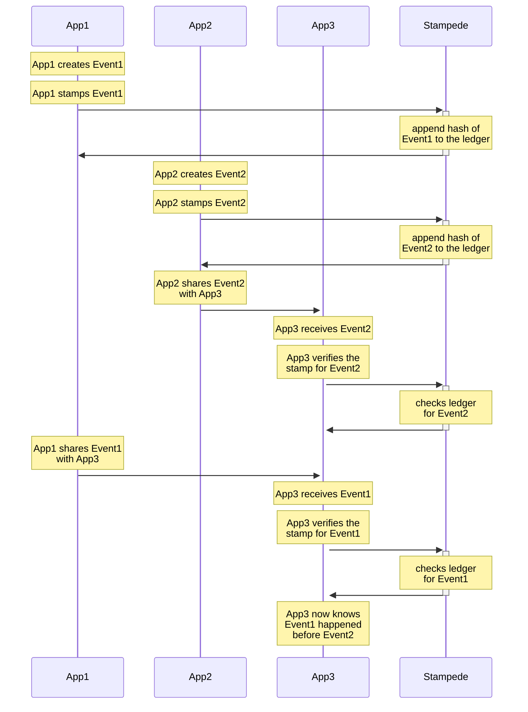

# Stampede

Distributed event ordering as a service

Jlinc Labs - October 2022


## Abstract

As centralized applications are replaced with decentralized networks and protocols, the need for "Proof-of-When" (or proof-of-sequence) has become critical.

When validating a digital event, Proof-of-Identity (authorship) is solved with cryptographic key pairs, however Proof-of-When that event happened requires either trust-in-all-parties or 3rd party attestation.

Current solutions "anchor" dWeb events by piggybacking on cryptocurrency ledgers, paying extra fees for expensive cryptocurrency consensus algorithms, which is wasteful for just anchoring data.

Stampede solves the Proof-of-When problem by providing decentralized sequencing at predictably stable close-to-cost prices.

Stampede is a level one (L1) blockchain who's sole purpose is sequence ordering events across distributed and distrusted applications.

Stampede is a decentralized "proof of sequence" algorithmic market. The market runs on a blockchain with a native token (called "CLOCK"), which Stampers earn by "stamping" client events. Conversely, clients pay CLOCK to Stampers to stamp events as they emit them.

Stamping your app events using Stampede ensures any receiver of your event can reliably check to see what order that event happened in relative to other events.

Stampede can operate at global scale because it uses an extremely lightweight proof-of-sequence consensus algorithm. Stampers do not need to work to prevent double spend.

Note: Stampede is a work in progress. Active research is under way, and new versions of this paper will appear at https://github.com/jlinclabs/stampede/blob/master/SPEC.md. For comments and suggestions, contact us at research@stampede.io.


1. [Introduction](#introduction)
2. [Actors](#actors)
    1. [Clients](#clients)
    2. [Stampers](#stampers)
3. [Stamping and event](#stamping-an-event)
    1. [Network](#network)
    1. [Stamps](#stamps)
4. [Blocks](#blocks)
5. [Incentive](#incentive)
    1. [CLOCK Coin](#clock-coin)
6. [Why not just anchor?](#why-not-just-anchor)
7. [Sequencing events](#sequencing-events)


## Introduction

Stampede is a layer 1 blockchain with a minimal consensus algorithm called proof-of-sequence.


## Actors

There are two types of actors in the system . Clients and Stampers.

### Clients

Clients are applications that emit events on the distributed web. Clients pay CLOCK to have their events stamped by stampers.

### Stampers

Stampers work together to sequence order events as they come into the network. Stampers earn CLOCK by writing blocks of stamps to the blockchain.

## Stamping an Event

Stamping an event strictly guarantees that said event happened after event X and before event Y.

When an application generates an event, before sharing it publicly, it hashes the event (e.g. SHA256) and makes a request to a Stampede client to have that event sequenced. Once stamped that event can be shared in any way and the receiving party can check the Stampede network to verify "when" (what order) that event happened.

## Network

The steps to run the network are as follows:

1. Clients hash their events and request for that hash to be stamped
2. New stamp requests are broadcast to all nodes
3. Each node collects new events into a block
4. Each node works to form the next block in exchange for CLOCK
5. When a node finalizes a block, it broadcasts it to all nodes
6. Nodes accept the block only if all blocks are a valid sequence of signed hashes and their included timestamp is close enough to their local system time

Nodes always consider the longest chain to be the correct one and will keep working on extending it. If two nodes broadcast different versions of the next block simultaneously, some nodes may receive one or the other first. In that case, they work on the first one they received, but save the other branch in case it becomes longer. The tie will be broken when the next block or signed events is written and one branch becomes longer; the nodes that were working on the other branch will then switch to the longer one.

A major performance advantage of Stampede is the ability for a node who just switched to a longer branch to re-write the missing blocks from the loosing branch(es) to the new main branch by re-hashing and proposing a new block.

New transaction broadcasts do not necessarily need to reach all nodes. As long as they reach many nodes, they will get into a block before long. Block broadcasts are also tolerant of dropped messages. If a node does not receive a block, it will request it when it receives the next block and realizes it missed one.

### Stamps

A Stamp attests to the fact that event X happened before T¹ and after T². A lot like a git commit, a stamp contains a time stamp but also falls in a specific place in the linear sequence.

Each stamp contains:
  - parent-hash: the hash of the latest block in the chain
  - event-hash: the hash submitted by the client
  - node-id: this node's public key (ID and wallet address)
  - client-id: the client's public key (ID and wallet address)
  - occurred-at: the hashing node's system clock time


### Blocks

Stamps are batched into blocks. Stamps are time-ordered within each block. Each Stamp within each batch is considered to have happened in the order by which they are listed in the batch. Each event must have a occurred-at time that is >= the previous stamp's occurred-at time.

The node that writes the block earns the CLOCK offered by the stamps contained in it.

### Scaling and Performance

#### Topical Chains

In the future, additional performance can be reached by reducing the time it takes to negotiate the next block by forking into topical blockchains.

Each Stamping Node in the network must work on all topic chains.

### Security

#### Claiming an event happened…

##### …before it really did

AKA A early-event-attack

Early-event-attacks are secured against by nodes rejecting new blocks that contain stamps with timestamps that are either older than the latest stamp on the chain or older than the node's right-now minus some wiggle-room.

##### …after it really did

AKA A late-event-attack

Late-event-attacks are secured against by nodes rejecting new blocks that contain stamps with timestamps that are newer than the node's right-now plus some wiggle-room.


### Networks

Stampede has three main networks:

- **stallion** - production network
- **buffalo** - development testnet
- **zebra** - edge features testnet

### API

#### JSON RPC

**Note: this API is a work in progress**

- `stamp_createStamp`
  - params:
    - event-hash: the hash (SHA256) of you event
    - client-id: your app's stampede wallet public key
- `stamp_getStamp`
  - params:
    - stamp-id: the stampede stamp id you want to get

Usage: 

```bash
// Request
curl -X POST --data '{"jsonrpc":"2.0","method":"stamp_createStamp","params":[{ …params }],"id":1}'
// Result
{ "id": 1, "jsonrpc": "2.0", "result": … }
```

#### Node.js Client

Sharing a stamped event

```js
import Stampede from '@stampede/client'

const stampede = new Stampede({
  network: 'stalion',
  publicKey: process.env.STAMPEDE_PUBLIC_KEY,
  secretKey: process.env.STAMPEDE_SECRET_KEY
})

// Create An Event
const event1 = {
  event: 'user created',
  userId: 1234,
  nonce: Math.random(),
}

// canonicalize the JSON and SHA256 hash it (deterministic)
const event1Hash = stampede.hashJSON(event1)
// stamp the hash of the event
const event1Stamp = await stampede.createStamp(event1Hash)
// alternate one-liner:
// const event1Stamp = await stampede.stampJSON(event1)

// Sharing a stamped event
await fetch('https://example.com/api/events', {
  method: 'POST',
  body: JSON.stringify({
    event: event1,
    stampedeId: event1Stamp.stampedeId
  })
})
```

Receiving a stamped event

```js
import Stampede from '@stampede/client'

const stampede = new Stampede({
  network: 'stalion',
  publicKey: process.env.STAMPEDE_PUBLIC_KEY,
  secretKey: process.env.STAMPEDE_SECRET_KEY
})

app.post('/api/events', (req, res) => {
  const { event, stampedeId } = req.body
  // Lookup the stamp by its stampedeId
  const { value: hash, sequenceIndex, occuredAt } = await stampede.getStamp(stampedeId)
  console.assert(stampede.hashJSON(event) === hash)
  // alternate one-liner
  // const { sequenceIndex, occuredAt } = await stampede.getStampForJSON(event)
})
```


## Incentive

Earning CLOCK coin for stamping events is the main financial incentive. Stampers can spend CPU/GPU to earn CLOCK coin and exchange it USD at a stable exchange rate.

Applications that pay CLOCK to have their events stamped by the network are incentivized to host their own nodes to earn back CLOCK by stamping the events of other applications.

If most of the nodes in the network are paid for by the applications that need event stamps to function; then the network should be relatively free. Nodes can both pay to have their app events stamped and earn by stamping the events of other apps.

Clients buy CLOCK coin and exchange it for having their app events stamped (sequence ordered) by the network.

### CLOCK Coin

CLOCK coin is a stable coin pined to a (TBD) commodities index more stable than USD. We aim to keep the amount of CLOCK a Stamp costs to be as affordable and predictable (consistent) as possible.

#### TBD

- Issuance algorithm
- Where you can buy and sell CLOCK
- Which commodities index CLOCK will be pegged to


### Who can stamp?

Anyone with spare CPU/GPU on a low-latency network will be able to easily run a stampede node.

Applications that emit a lot of events and want to offset their Stamping costs can also run nodes to earn back from CLOCK.

## Why not just anchor?

Many modern distributed systems use one or more blockchains to "anchor" a reference to their data. This is often just for immutability but it's also often used for the purposes of resolving the order of events in time.

The Stampede network aims to both improve the speed and reduce the cost of reliably time stamping events across untrusted distributed systems.


## Sequencing events

The network is broken into two bodies. Clients and Stampers. Clients request data be stamped and Stampers. Other Clients request verification of stamps from Clients.




## Use Cases

Any applications that share events with untrusted peers can reliably time-order those events when they're stamped by Stampede.

### Distributed Apps & Databases

- Non-monetary data focused networks like Ceramic, TBD/Web5, etc.
- dApps
- Decentralized audit logs

### Industries

- Supply chain accounting
- Private peer-to-peer chat & social applications

<br/>
<br/>

----
Copyright [Jlinc Labs](https://www.jlinc.com/) 2022
