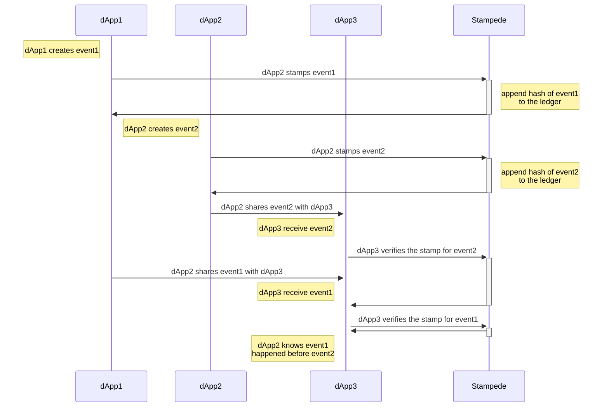

# Stampede

Distributed event ordering as a service

Jlinc Labs - October 2022

## Abstract

As centralized applications are replaced with decentralized networks and protocols, the need for "proof of event sequence" has become critical. 

When validating a digital event; Proof-of-Identity (authorship) is solved with cryptographic key pairs, However Proof-of-When that event happened requires either trust-in-all-parties or 3rd party attestation.

Current solutions "anchor" dWeb events by piggybacking on cryptocurrency ledgers, paying expensive fees for overkill consensus algorithms.

Stampede solves the Proof-of-When problem by providing decentralized sequencing at close-to-cost prices.

Stampede is a level one (L1) blockchain who's sole purpose is sequence ordering events across distributed and distrusted applications.

Stampede is a decentralized "proof of sequence" algorithmic market. The market runs on a blockchain with a native token (called "CLOCK"), which Stampers earn by "stamping" client events. Conversely, clients pay CLOCK to Stampers to stamp events as they emit them.

Stamping your app events using Stampede ensures any receiver of your event can reliably check to see what order that event happened in relative to other events.

Stampede can operate at global scale because it uses an extremely lightweight proof-of-sequence consensus algorithm. Stampers do not need to work to prevent double spend.

Note: Stampede is a work in progress. Active research is under way, and new versions of this paper will appear at https://github.com/jlinclabs/stampede/blob/master/SPEC.md. For comments and suggestions, contact us at research@stampede.io.

1. [Introduction](#introduction)
2. [Actors](#actors)
    1. [Clients](#clients)
    2. [Stampers](#stampers)
3. [Stamping and event](#stamping-an-event)
    1. [Network](#network)
    1. [A Stamp](#a-stamp)
4. [Blocks](#blocks)
5. [Incentive](#incentive)
    1. [CLOCK Coin](#clock-coin)
6. [Why not just anchor?](#why-not-just-anchor)
7. [Sequencing events](#sequencing-events)

## Introduction

Stampede is a layer 1 blockchain with a minimal consensus algorithm called proof-of-sequence.

## Actors

1. Clients pay CLOCK to have their events sequenced
2. Stampers earn CLOCK by writing blocks of events to the chain

### Clients

### Stampers

## Stamping an Event

Stamping an event strictly guarantees that said event happened after event X and before event Y. 

When an applications generates an event, before sharing it publically, it hashes the event (e.g. SHA256) and makes a request to a stampede client to have that event sequenced. Once stamped that event can be shared in anyway and the receiving party can check that stampede network to know "when" (what order) your event happened. 

### Network

The steps to run the network are as follows:

1. Clients hash their events and request for that hash to be stamped
1. New stamp requests are broadcast to all nodes.
1. Each node collects new events into a block. 
1. Each node works to form the next block in exchange for CLOCK
1. When a node finalizes a block, it broadcasts it to all nodes.
1. Nodes accept the block only if all blocks are a valid sequence of signed hashes and their included timestamp is close enough to the local system time.

Nodes always consider the longest chain to be the correct one and will keep working on extending it. If two nodes broadcast different versions of the next block simultaneously, some nodes may receive one or the other first. In that case, they work on the first one they received, but save the other branch in case it becomes longer. The tie will be broken when the next block or signed events is written and one branch becomes longer; the nodes that were working on the other branch will then switch to the longer one.

A major performance advantage of Stampede is the ability for a node who just switched to a longer branch to re-write the missing blocks from the loosing branch(es) to the new main branch by re-hashing and proposing a new block.

New transaction broadcasts do not necessarily need to reach all nodes. As long as they reach many nodes, they will get into a block before long. Block broadcasts are also tolerant of dropped messages. If a node does not receive a block, it will request it when it receives the next block and realizes it missed one.

### A Stamp

A Stamp attests to the fact that event X happened before T¹ and after T². A lot like a git commit, a stamp contains a time stamp but also falls in specific order sequence. 

Each stamp contains:
  - parent-hash: the hash of the latest block in the chain
  - event-hash: the hash submitted by the client
  - node-id: this node's public key (ID and wallet address)
  - client-id: the client's public key (ID and wallet address)
  - hashed-at: the hashing node's system clock time

Each sequence request event in a batch is considered to have happened in the order by which they are listed in the batch. Each event must have a hashed-at time that is >= the previous stamp's hashed-at time. 

### Blocks

Each block is a batch of ordered stamps. Each node attempts to earn the offered CLOCK by creating the next block. The node that writes the block earns the CLOCK offered by the stamps contained in it.

## Incentive

Earning CLOCK coin for stamping events is the main financial incentive. Stampers can spend CPU/GPU to earn CLOCK coin and exchange it USD at a stable exchange rate. 

Applications that pay CLOCK to have their events stamped by the network are incentivized to host their own nodes to earn back CLOCK by stamping the events of other applications. 

If most of the nodes in the network are paid for by the applications that need event stamps to function; then the network should be relatively free. Nodes can both pay to have their app events stamped and earn by stamping the events of other apps.

Clients buy CLOCK coin and exchange it for having their app events stamped (sequence ordered) by the network.

### CLOCK Coin 

CLOCK coin is a stable coin pined to an index (TBD) more stable than USD. We aim to keep the amount of CLOCK a Stamp costs to be as affordable and predictable (consistent) as possible.

##### TBD

- Issuance algorithm
- Where you can buy and sell CLOCK 
- Index CLOCK is pegged to

## Why not just anchor?

Many modern distributed systems use one or more blockchains to "anchor" a reference to their data. This is often just for immutability but it's also often used for the purposes of resolving the order of events in time. 

The Stampede network aims to both improve the speed and reduce the cost of reliably timestamping events across untrusted distributed systems.

## Sequencing events
The network is broken into two bodies. Clients and Stampers. Users request data be chronstamped and Observers chronstamp Users's data.

## DOCUMENT EDIT NOTES

- we use [Threshold_cryptosystem](https://en.wikipedia.org/wiki/Threshold_cryptosystem)
- touch on the "Byzantine Generals’ Problem"
- produce a sequence integer   

### Unknowns

- do we need to write a chronological timestamp to the blocks?
  - do we need consesus checking hashing and time window?
- do we need to ensure that the data were hashing has not been seen before? 
  - Is there an attack enabled by re-stamping the same value?
- does mining generate new clock? no
